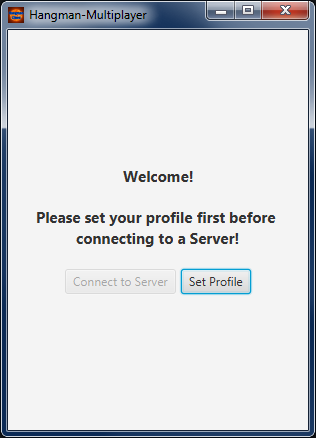
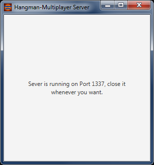

# Hangman-Multiplayer
A networking Version of Hangman.

## How to use
1. Go to the [Releases-Tab](../../releases) and download at least the Client (**hangman_client.jar**). When you want **to host**, you should also get the **hangman_server.jar**. Put the file(s) into a folder wherever you want but **don't let them in the Downloads Folder** since both the Client and the Server will create a configuration file in that folder.

2. For the Host: Double-click the hangman_server.jar. Make sure to tell you friend your IP address and the Port you have chosen so that he can join your server. To get your IP: Just search for your IP address online ([this site](http://www.myipaddress.com/show-my-ip-address/) is one of the sites which will give you your IP address). You will also need to open a port in your router, else nobody can connect to your PC from outside (which is also good but one uncommon port shouldn't be dangerous). Just google for your Wi-Fi Router and how to open Ports. If you are experienced, you can host the Server without a GUI by typing `java -jar hangman_server.jar <<port>>` into a Command Line.

3. For the Client: Just double click the hangman_client.jar, it will open a little fancy GUI for you. For the first use, you must set a few things like your nickname. Let me explain the values: - "Name" is a Nickname you want to use, feel free to be as creative as you want but a few names are locked for obvious reasons. - "Server IP" is the IP-Address of the Server, you can't choose that and you need to get it from your friend or a public host service. - "Server Port" is a number which will be used that nobody can join a Server by accident. If you want to know more about Ports, read the FAQ or google for it, it's really interesting!  When you are done, click "Save & Return" and now you can join the Server.

## Pictures
Here some pictures that you know how the GUI looks like:

### Client
 
 
 

### Server
 

### Icons

## FAQ
- Q: How to play? 
  A: Read the text above. ;)
  
- Q: What is a port and why is it dangerous when I open it? 
  A: Well, it's hard to explain without getting to deep. A port is basically a number for a service / protocol, a Webserver has the Port 80, SMTP has 25 and many more. Also when you open / forward a port to the Internet, everybody in the world who has you IP can scan for open ports and send data over this port to your computer which could be dangerous (which is kind of unlikely to be honest). When you take an uncommon Port, the chances are even smaller that this open port will be recognized by popular services.
  
- Q: Which names are restricted? 
  A: Find it out. ;)